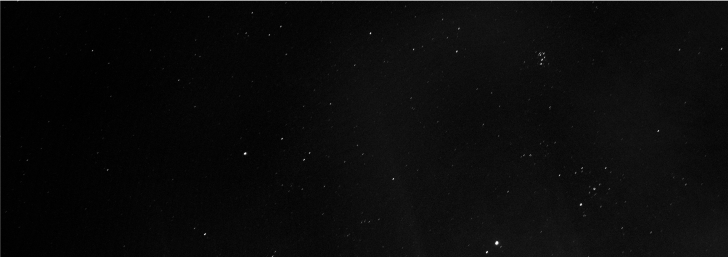

# ykk2b

React/Rust Developer

- 💻 Learning compilers/interpreters
- 🌐 Experienced in front-end developement
- 🔭 Intrested in astronomy

## Tech Stack

  
  
  
  
  
  
  
  
  

### Learning

  
  
  
  
  

